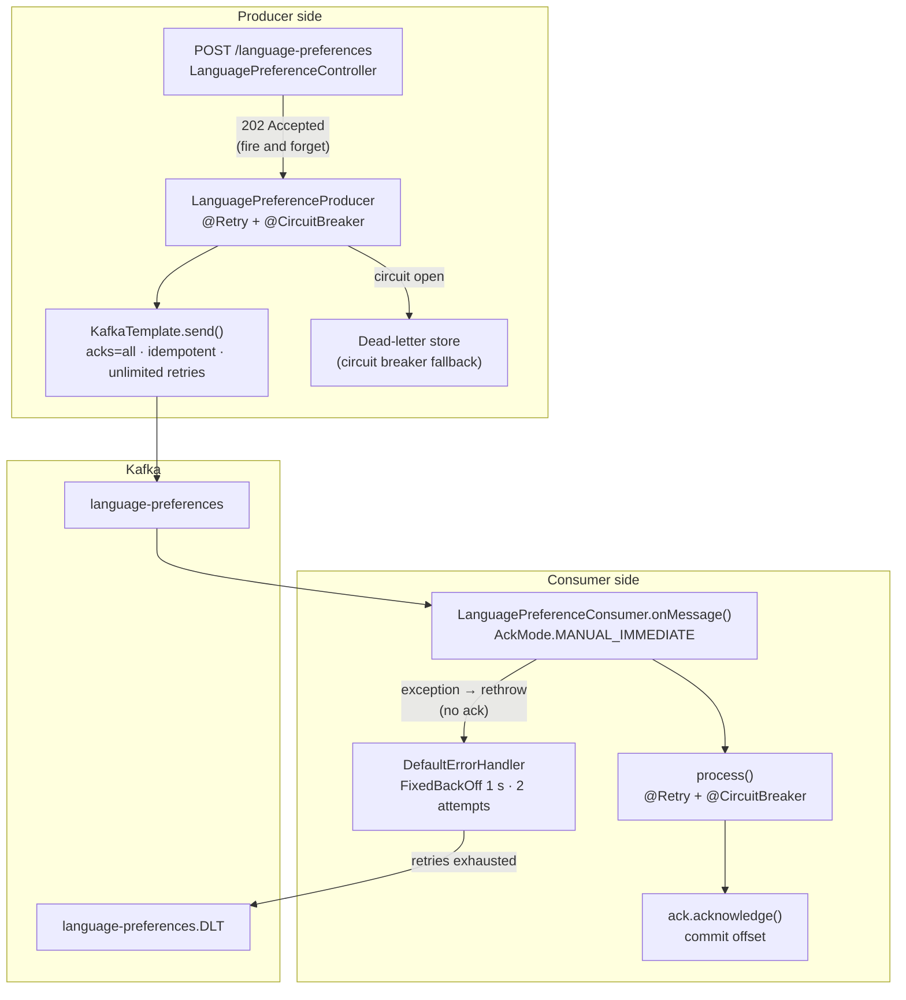
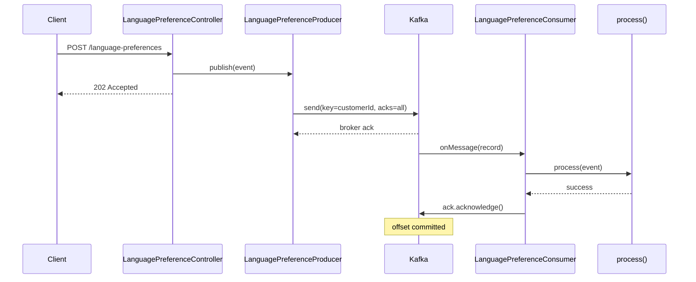
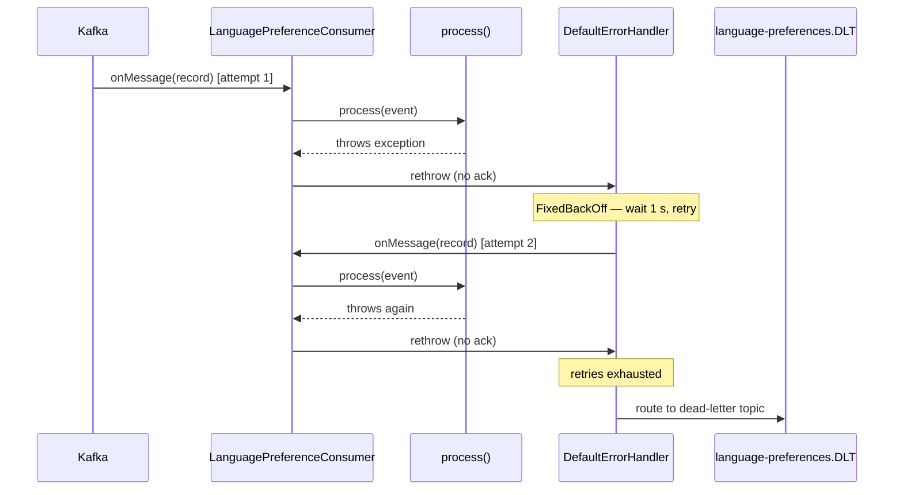
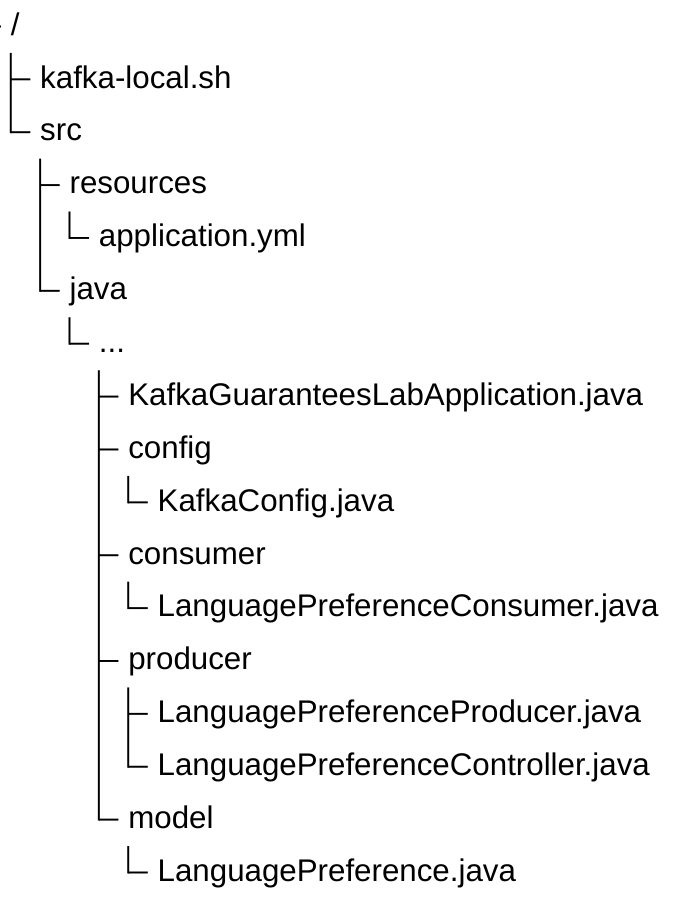

# KafkaGuaranteesLab

[](LICENSE)

A Spring Boot application demonstrating the limitations of Kafka guarantees. It layers producer/consumer
configuration with Resilience4j circuit breakers and retries to show how the guarantee is maintained end-to-end
under failure. Kafka itself is configured for its strongest guarantee — an idempotent producer with `acks=all` —
which deduplicates broker-level retries within a producer session. The demo shows
how this can greatly reduce the number of duplicate messages but cannot eliminate them entirely without
risking data loss.

## The Problem

Kafka provides strong delivery and ordering guarantees for applications that follow the API contract. Under most
conditions, every message is processed exactly once and in the same order by both producer and consumer. However,
developers need to be aware of the boundaries and plan for failures. This demo shows how to handle common failure modes.

### A Quick Peek Under the Covers

To understand where things can go awry, it's helpful to understand what happens when things go right. There are
three common delivery guarantees for messages:

* *At-most-once* guarantees that a message is delivered either once or not at all. Conceptually, the easiest way to
  ensure this is to try to send the message one time and never retry.
* *At-least-once* guarantees that a message is delivered at least once, but maybe more. Conceptually, the
  easiest way to ensure this is to send the message and retry until it is acknowledged.
* *Exactly-once* guarantees that a message is delivered once and no more. Conceptually, this is the same
  as simultaneously guaranteeing both at-least-once *and* at-most-once.

Obviously, you can't get exactly-once by using the easy approaches to at-most-once and at-least-once at the same time.
What you can do instead is use retries as needed to ensure at least once delivery, then filter duplicates. Duplicates
can happen when the sender retries while the receiver is down, or when the receiver is slow to process
messages. Kafka implements a limited exactly-once guarantee by doing just that:

* At-least-once comes from retrying until the broker acknowledges. `acks=all` makes that acknowledgement
  durable: each message is persisted by all in-sync replicas before the broker acks, so an acked message
  survives a broker failure.
* The at-most-once half, suppressing duplicates from those retries, comes from `enable.idempotence=true`,
  which has Kafka assign a unique key (producer ID + sequence number) to each message so the broker can drop a
  replayed one.

Both `acks=all` and `enable.idempotence=true` have been default Kafka settings since 3.0.0. In addition, if
idempotence is enabled, Kafka will automatically require `acks=all` for durable writes.

### Common Failure Modes

There are a few ways that exactly-once processing can fail even with idempotence enabled.

#### Timeout and Retry

Suppose a producer application has this code:

```java
public void send(Record<String,Foo> record) {
    producer.send(record);
    Thread.sleep(5);
    producer.send(record);       // Send the same record again
}
```

Kafka would send the first message, wait 5 milliseconds, then send a second message with exactly the same contents.
Kafka will view this as two separate messages. Each will be assigned a unique sequence number, and both will be delivered.

Now consider a producer application with a retry configured like this:

```java
@Retry(delay = 5)
public void send(Record<String,Foo> record) {
    producer.send(record);
}
```

If the first attempt times out (5ms is way too short), the retry will be triggered. But the first attempt might yet
succeed even after the retry. As before, Kafka would send the same message twice with different sequence numbers.
You can mitigate this failure by ensuring Kafka's internal retry loop finishes before the application retries.
Enabling idempotence requires `retries` > 0. The critical setting is `delivery.timeout.ms`, which bounds the
whole send including internal retries. Keep it *no larger* than the application's per-attempt timeout, or simply
gate the application retry on the `send()` future completing. Idempotence dedups only Kafka's own retries. A
fresh application-level `send()` gets a new sequence number and is not filtered.

#### Exception on Send

The producer might throw an exception or otherwise indicate failure on a `send()` call.

* `producer.send()` throws an exception
* On the Future returned by `send()`:
    * Any method throws an exception, including if `get(timeout)` times out
    * `isCancelled()` returns true
* On the `RecordMetadata` returned by `send().get()`:
    * `hasOffset()` or `hasTimestamp()` returns false
    * `offset()`, `timestamp()` or `partition()` returns -1
 
In most cases, the failure means the producer did not send the message successfully. However, there are a few cases
where the message did get sent despite the failure. Retries from the application tier *may* send duplicate messages
in those cases.

**Tip:** These types of failures may indicate a problem with the producer configuration. Pay particular attention to
the `acks`, `retries`, `delivery.timeout.ms` and `max.in.flight.requests.per.connection` settings.

#### Boundaries after Restart

If a producer application crashes after sending a message but before the broker acknowledges the receipt or before the
receipt is recorded by the producer, the message may be delivered again when the application restarts. This can lead to
duplicate messages. After restart, the producer will be assigned a new PID. Any message delivered before the
crash but un-acked (network loss, timeout) will be re-sent under the new PID — the broker has no way
to recognise it as a duplicate. Idempotence is per-session, not durable across process lifetimes.

#### Duplicate Producer Processes

While outside the realm of Kafka, if multiple producer instances share the same logical role then each will have a
different PID. The broker deduplicates per-PID, so each instance will send its own messages. This can lead to duplicate
messages if the same event is published by multiple instances.

## What This Demo Shows

- **`acks=all` with idempotent producer**: `enable.idempotence=true` with unlimited retries ensures
  at least one durable write while preventing duplicates from Kafka-level retries
- **Manual offset commit**: `AckMode.MANUAL_IMMEDIATE` commits the offset only after `process()`
  succeeds; a crash before `ack.acknowledge()` causes redelivery, not loss
- **Application-layer retry**: Resilience4j `@Retry` on both producer and consumer handles transient
  downstream failures (3 attempts, 1 s wait each)
- **Circuit breaker isolation**: independent Resilience4j `@CircuitBreaker` instances protect
  against cascading failure; the producer fallback routes to a dead-letter store when the circuit
  opens
- **Dead-letter topic (DLT)**: messages that exhaust `DefaultErrorHandler` retries on the consumer
  side are routed to `language-preferences.DLT` rather than silently dropped
- **Observability**: Actuator exposes `health`, `circuitbreakers`, `retries`, and `prometheus`
  endpoints; circuit breaker state is surfaced in the health check

## Requirements

- Java 17 or higher (Java 25 toolchain used for compilation)
- Kafka broker on `localhost:9092` (or use the included `kafka-local.sh`)

## Running the Demo

Start a local Kafka broker in KRaft mode (no ZooKeeper):

```bash
./kafka-local.sh start
```

Build and run:

```bash
./gradlew bootRun
```

Send a language preference event:

```bash
curl -X POST http://localhost:8080/language-preferences \
  -H 'Content-Type: application/json' \
  -d '{"customerId": "abc123", "preferredLanguage": "fr-CA"}'
# HTTP 202 Accepted
```

Check circuit breaker and retry state:

```bash
curl http://localhost:8080/actuator/circuitbreakers
curl http://localhost:8080/actuator/retries
```

Stop the broker when done:

```bash
./kafka-local.sh stop
```

## Architecture

### Delivery guarantee layers

At-least-once delivery is enforced at two independent layers. The Kafka broker protocol handles
durability on the producer side. Manual offset management handles redelivery on the consumer side.
Resilience4j adds application-level retry and circuit breaking on top of both.



### Sequence: successful delivery



### Sequence: consumer failure and DLT routing



## Configuration reference

### Kafka producer

| Setting | Value | Purpose |
|---|---|---|
| `acks` | `all` | All in-sync replicas must acknowledge before the send completes |
| `enable.idempotence` | `true` | Prevents duplicate records from broker-level retries |
| `retries` | `Integer.MAX_VALUE` | Retries transient errors until `delivery.timeout.ms` elapses; the time bound, not the count, limits retries |
| `delivery.timeout.ms` | `120000` (default) | Upper bound on a single send, including all internal retries; not overridden in `KafkaConfig` |
| `max.in.flight.requests.per.connection` | `5` | Maximum allowed with idempotence enabled |

### Kafka consumer

| Setting | Value | Purpose |
|---|---|---|
| `enable.auto.commit` | `false` | Offset committed manually after successful processing only |
| `auto.offset.reset` | `earliest` | No committed offset on first start — consume from the beginning |
| `AckMode` | `MANUAL_IMMEDIATE` | Commits immediately when `ack.acknowledge()` is called |

### Resilience4j

Both the producer and consumer have independent instances configured in `application.yml`.

#### Circuit breaker defaults

| Instance | Failure threshold | Slow call threshold | Slow duration | Wait in open |
|---|---|---|---|---|
| `languagePreferenceProducer` | 50% | 80% | 2 s | 30 s |
| `languagePreferenceConsumer` | 50% | — | — | 30 s |

Both instances use a count-based sliding window of 10 calls. The producer permits 3 calls in the
half-open state; the consumer leaves this at the Resilience4j default of 10.

#### Retry defaults

Both instances: 3 attempts, 1 s fixed wait, retries on any `Exception`.

### DefaultErrorHandler

`FixedBackOff(1 s, 2 attempts)` — up to 2 delivery retries before the message is routed to the
dead-letter topic. This operates at the Kafka listener container layer, independently of the
Resilience4j retry inside `process()`.

## Layout




## Technologies

| Component | Version |
|-----------|---------|
| Java | 25 (toolchain; runs on 17+) |
| Gradle | 9.6.1 |
| Spring Boot | 4.0.6 |
| Resilience4j | 2.4.0 |
| Spring Kafka | (via Spring Boot) |
| Micrometer/Prometheus | (via Spring Boot) |
| JaCoCo | 0.8.14 |

## Links

- [GitHub repository](https://github.com/bhanafee/KafkaGuaranteesLab)
- [Javadoc](https://bhanafee.github.io/KafkaGuaranteesLab/javadoc/)
- [Test Results](https://bhanafee.github.io/KafkaGuaranteesLab/tests/)
- [Coverage Report](https://bhanafee.github.io/KafkaGuaranteesLab/coverage/)
- [Apache 2.0 License](https://bhanafee.github.io/KafkaGuaranteesLab/LICENSE)
- [Code of Conduct](https://bhanafee.github.io/KafkaGuaranteesLab/CODE_OF_CONDUCT.html)
- [Claude Code guidance](https://bhanafee.github.io/KafkaGuaranteesLab/CLAUDE.html)
