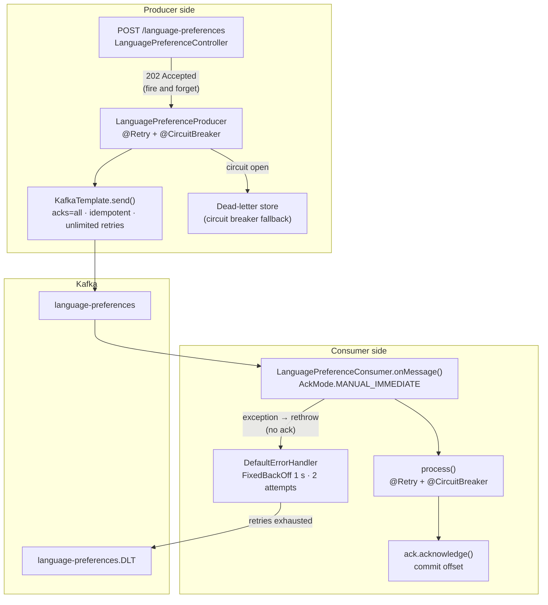
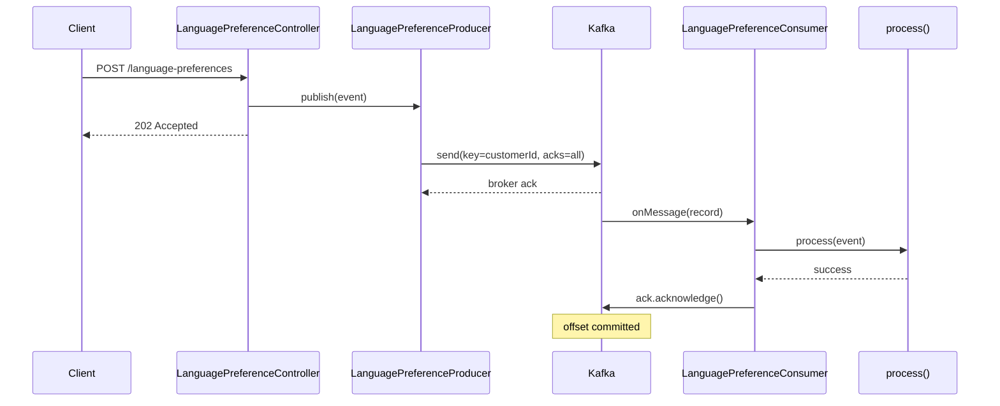
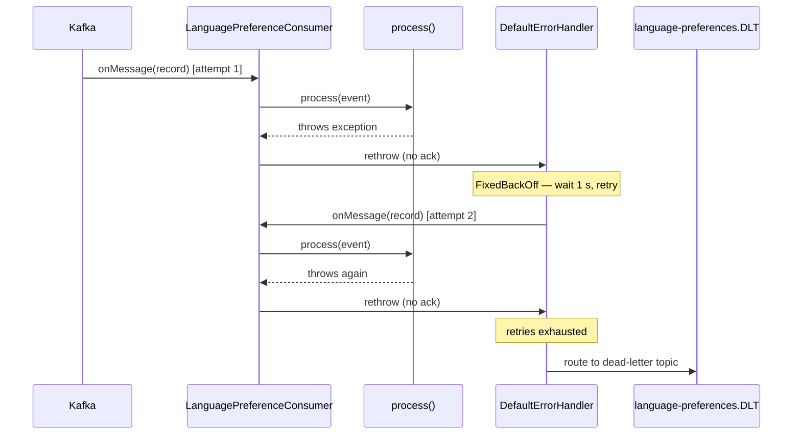
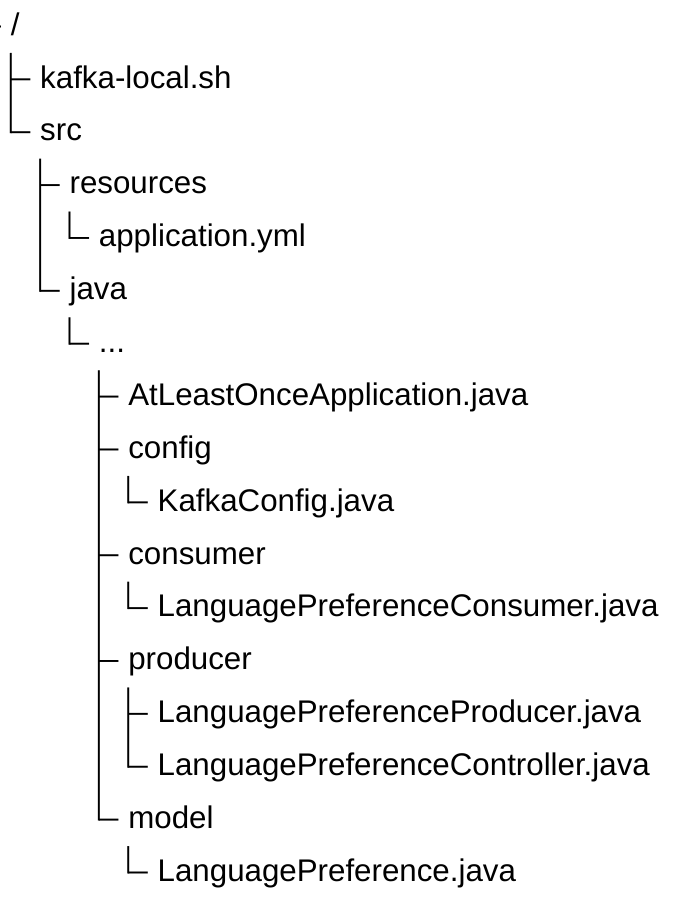

# KafkaGuaranteesLab

A Spring Boot application demonstrating **at-least-once delivery semantics** using Kafka. It layers
producer/consumer configuration with Resilience4j circuit breakers and retries to show how the guarantee
is maintained end-to-end under failure. Kafka itself is configured for exactly once delivery using an
idempotency key. The demo shows how this can greatly reduce the number of duplicate messages, but cannot
eliminate them entirely without risking data loss.

## The Problem

Kafka provides strong delivery guarantees for applications that follow the API contract. Under most conditions,
every message is processed exactly once by both producer and consumer. However, developers need to be aware of
the boundaries and plan for failures. This demo shows how to handle common failure modes.

### A Quick Peek Under the Covers

To understand where things can go awry, it's helpful to understand what happens when things go right. There are
three common delivery guarantees for messages:

* *At-most-once* guarantees that a message is delivered either once or not at all. Conceptually, the easiest way to
  ensure this is to try to send the message one time and never retry.
* *At-least-once* guarantees that a message is delivered at least once, but maybe more. Conceptually, the
  easiest way to ensure this is to send the message and retry until it is acknowledged.
* *Exactly-once* guarantees that a message is delivered once and no more. Conceptually, this is the same 
  as simultaneously guaranteeing both at-least-once *and* at-most-once.

Obviously, you can't get exactly-once by using the easy approaches to at-most-once and at-least-once at the same time.
What you can do instead is use retries as needed to ensure at least once delivery, then filter duplicates. Duplicates
can happen when the sender retries while the receiver is down, or when the receiver is slow to process
messages. That's what Kafka does when `enable.idempotence=true` is set. Each new message is assigned a unique identifier
consisting of a process id and a sequence number, and duplicates are filtered out by the broker.

### Common Failure Modes

1. **Producer acknowledgement failure**: when an application sends a message, but the broker does not confirm receipt.
2. **Offset commit before processing**: auto-commit advances the offset before `process()` finishes,
   so a crash between the commit and the work silently drops the message.
3. **Application-level failure without fallback**: an exception thrown inside the listener that is
   not caught or retried at the framework level leaves the message neither processed nor
   dead-lettered.

Each layer has a different remedy, and this demo shows all three.

## What This Demo Shows

- **`acks=all` with idempotent producer**: `enable.idempotence=true` with unlimited retries ensures
  at least one durable write while preventing duplicates from Kafka-level retries
- **Manual offset commit**: `AckMode.MANUAL_IMMEDIATE` commits the offset only after `process()`
  succeeds; a crash before `ack.acknowledge()` causes redelivery, not loss
- **Application-layer retry**: Resilience4j `@Retry` on both producer and consumer handles transient
  downstream failures (3 attempts, 1 s wait each)
- **Circuit breaker isolation**: independent Resilience4j `@CircuitBreaker` instances protect
  against cascading failure; the producer fallback routes to a dead-letter store when the circuit
  opens
- **Dead-letter topic (DLT)**: messages that exhaust `DefaultErrorHandler` retries on the consumer
  side are routed to `language-preferences.DLT` rather than silently dropped
- **Observability**: Actuator exposes `health`, `circuitbreakers`, `retries`, and `prometheus`
  endpoints; circuit breaker state is surfaced in the health check

## Requirements

- Java 17 or higher (Java 25 toolchain used for compilation)
- Kafka broker on `localhost:9092` (or use the included `kafka-local.sh`)

## Running the Demo

Start a local Kafka broker in KRaft mode (no ZooKeeper):

```bash
./kafka-local.sh start
```

Build and run:

```bash
./gradlew bootRun
```

Send a language preference event:

```bash
curl -X POST http://localhost:8080/language-preferences \
  -H 'Content-Type: application/json' \
  -d '{"customerId": "abc123", "preferredLanguage": "fr-CA"}'
# HTTP 202 Accepted
```

Check circuit breaker and retry state:

```bash
curl http://localhost:8080/actuator/circuitbreakers
curl http://localhost:8080/actuator/retries
```

Stop the broker when done:

```bash
./kafka-local.sh stop
```

## Architecture

### Delivery guarantee layers

At-least-once delivery is enforced at two independent layers. The Kafka broker protocol handles
durability on the producer side. Manual offset management handles redelivery on the consumer side.
Resilience4j adds application-level retry and circuit breaking on top of both.



### Sequence: successful delivery



### Sequence: consumer failure and DLT routing



## Configuration reference

### Kafka producer

| Setting | Value | Purpose |
|---|---|---|
| `acks` | `all` | All in-sync replicas must acknowledge before the send completes |
| `enable.idempotence` | `true` | Prevents duplicate records from broker-level retries |
| `retries` | `Integer.MAX_VALUE` | Delegates retry decisions to the application and circuit breaker |
| `max.in.flight.requests.per.connection` | `5` | Maximum allowed with idempotence enabled |

### Kafka consumer

| Setting | Value | Purpose |
|---|---|---|
| `enable.auto.commit` | `false` | Offset committed manually after successful processing only |
| `auto.offset.reset` | `earliest` | No committed offset on first start — consume from the beginning |
| `AckMode` | `MANUAL_IMMEDIATE` | Commits immediately when `ack.acknowledge()` is called |

### Resilience4j

Both the producer and consumer have independent instances configured in `application.yml`.

#### Circuit breaker defaults

| Instance | Failure threshold | Slow call threshold | Slow duration | Wait in open |
|---|---|---|---|---|
| `languagePreferenceProducer` | 50% | 80% | 2 s | 30 s |
| `languagePreferenceConsumer` | 50% | — | — | 30 s |

Both instances use a count-based sliding window of 10 calls with 3 calls permitted in half-open
state.

#### Retry defaults

Both instances: 3 attempts, 1 s fixed wait, retries on any `Exception`.

### DefaultErrorHandler

`FixedBackOff(1 s, 2 attempts)` — up to 2 delivery retries before the message is routed to the
dead-letter topic. This operates at the Kafka listener container layer, independently of the
Resilience4j retry inside `process()`.

## Layout




## Technologies

| Component | Version |
|-----------|---------|
| Java | 25 (toolchain; runs on 17+) |
| Gradle | 9.5.1 |
| Spring Boot | 4.0.6 |
| Resilience4j | 2.4.0 |
| Spring Kafka | (via Spring Boot) |
| Micrometer/Prometheus | (via Spring Boot) |
| JaCoCo | 0.8.14 |

## Links

- [GitHub repository](https://github.com/bhanafee/KafkaGuaranteesLab)
- [Javadoc](https://bhanafee.github.io/KafkaGuaranteesLab/javadoc/)
- [Test Results](https://bhanafee.github.io/KafkaGuaranteesLab/tests/)
- [Coverage Report](https://bhanafee.github.io/KafkaGuaranteesLab/coverage/)
- [Apache 2.0 License](https://bhanafee.github.io/KafkaGuaranteesLab/LICENSE)
- [Code of Conduct](https://bhanafee.github.io/KafkaGuaranteesLab/CODE_OF_CONDUCT.html)
- [Claude Code guidance](https://bhanafee.github.io/KafkaGuaranteesLab/CLAUDE.html)
